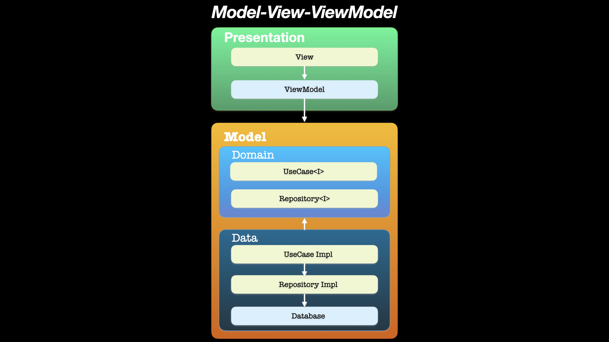
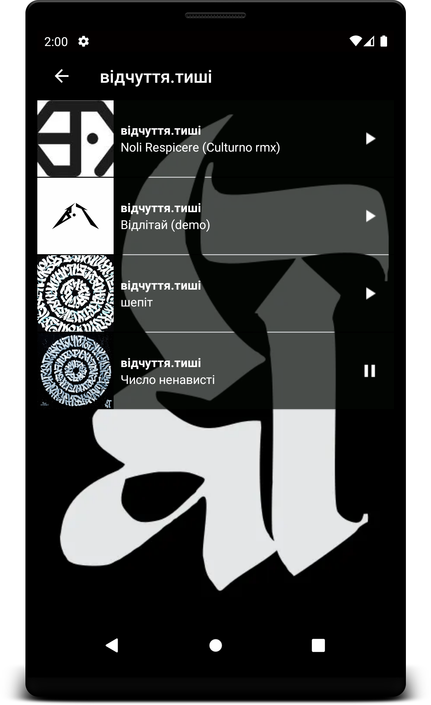
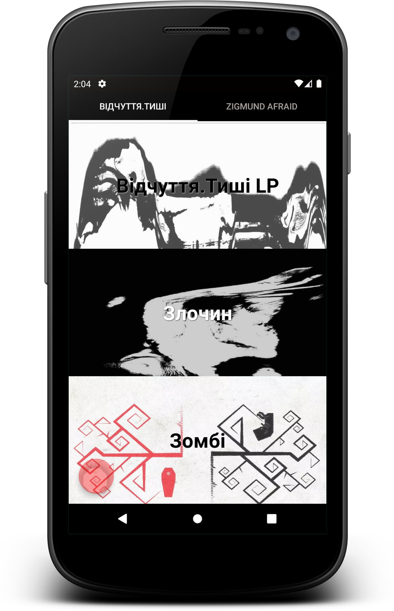
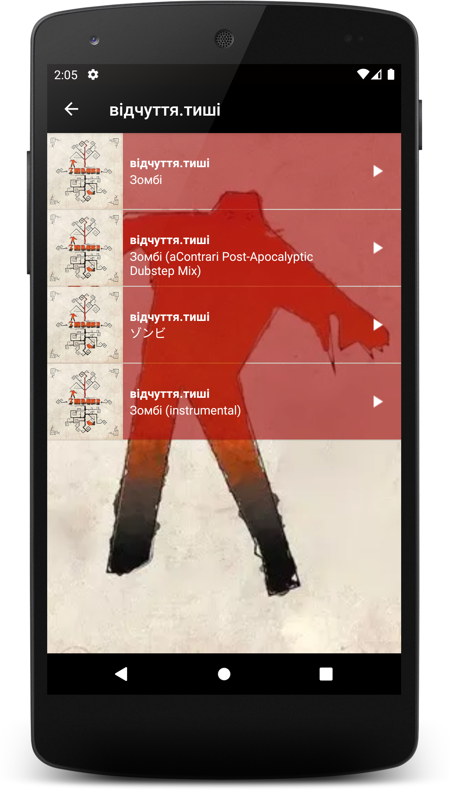

# sense.of.silence & Zigmund Afraid

Online Music Player for particular Music Band "відчуття.тиші"  (where I used to play on piano), with
an opportunity to listen to almost all their songs online.

## PROJECT SPECIFICATION

• Programming language: [Java](https://www.oracle.com/java/);

• SDK: [Android](https://developer.android.com/studio/intro);

• Interface: [XML](https://developer.android.com/guide/topics/ui/declaring-layout);

• State management approach:
[ViewModel](https://developer.android.com/reference/androidx/lifecycle/ViewModel);

• Database: [Room](https://developer.android.com/training/data-storage/room);

• Dependency injection:
[Hilt](https://developer.android.com/training/dependency-injection/hilt-android);

• Reactive programming: [ReactiveX](http://reactivex.io/) with
[RxJava3](https://github.com/ReactiveX/RxJava);

• Version control system: [Git](https://git-scm.com);

• Git Hosting Service: [GitHub](https://github.com);

• CI/CD: [GitHub Actions](https://docs.github.com/en/actions) is used to deliver new Android
Package (APK) to [Firebase App Distribution](https://firebase.google.com/docs/app-distribution)
after every push to the **dev** branch, [Codemagic](https://codemagic.io/start/) is used to deliver
new release app bundle to **Google Play** after every push to **master** branch;

• App testing platforms:
[Firebase App Distribution](https://appdistribution.firebase.dev/i/0fab69b4a3a132f6);

• App store:
[Google Play](https://play.google.com/store/apps/details?id=com.music.android.sensilence);

• Operating system: [Android](https://www.android.com/);

• Cloud services: [Firebase Cloud Messaging](https://firebase.google.com/docs/cloud-messaging);

• UI components: [ViewPager2](https://developer.android.com/jetpack/androidx/releases/viewpager2),
[View Binding](https://developer.android.com/topic/libraries/view-binding)

• Architecture Components:
[LiveData](https://developer.android.com/topic/libraries/architecture/livedata),
[ViewModel](https://developer.android.com/topic/libraries/architecture/viewmodel);

• Architectural pattern:
 

 

• **Screenshots:**

• **Layout:** the app contains 5 lists of relevant songs, user can navigate between lists using a
central screen and a View pager, each list item contains information about a song and a picture,
screens include cover pictures of the albums on the background;

• **Functionality:** app uses a custom adapter to populate the layout with views based on instances
of the custom class, all images are stored as drawables, the code runs without errors;

• **Code Readability:** code is easily readable with no unnecessary blank lines, no unused variables
or methods, and no commented-out code, all variables, methods, and resource IDs are descriptively
named such that another developer reading the code can easily understand their function.

## Privacy Policy

Dmytro Turskyi built the Відчуття.Тиші & Zigmund Afraid app as a free app. This service is provided
by Dmytro Turskyi at no cost and is intended for use as is.

This page is used to inform visitors regarding policies with the collection, use, and disclosure
of personal information if anyone decided to use this service.

If you choose to use this service, then you agree to the collection and use of information in
relation to this policy. The personal information that app collects is used for providing and
improving
the service. App will not use or share your information with anyone except as described in this
privacy policy.

**Information Collection and Use**

For a better experience, while using this service, app may require you to provide with certain
personally identifiable information. The information that app request will be retained on your
device
and is not collected by Dmytro Turskyi in any way.

The app does use third-party services that may collect information used to identify you.

Link to the privacy policy of third-party service providers used by the app

* [Google Play Services](https://www.google.com/policies/privacy/)
* [Google Analytics for Firebase](https://firebase.google.com/policies/analytics)
* [Firebase Crashlytics](https://firebase.google.com/support/privacy/)

**Log Data**

You should be informed that whenever you use this service, in a case of an error in the app your
data and information will be collected (through third-party products) on your phone called log data.
This log data may include information such as your device internet protocol (“IP”) address, device
name, operating system version, the configuration of the app when utilizing this service, the time
and date of your use of the service, and other statistics.

**Cookies**

Cookies are files with a small amount of data that are commonly used as anonymous unique
identifiers. These are sent to your browser from the websites that you visit and are stored on your
device's internal memory.

This service does not use these “cookies” explicitly. However, the app may use third-party code and
libraries that use “cookies” to collect information and improve their services. You have the option
to either accept or refuse these cookies and know when a cookie is being sent to your device. If you
choose to refuse our cookies, you may not be able to use some portions of this service.

**Service Providers**

Dmytro Turskyi may employ third-party companies and individuals due to the following reasons:

* To facilitate this service;
* To provide the service on behalf of Dmytro Turskyi;
* To perform service-related services; or
* To assist us in analyzing how this service is used.

Users should be informed of this service that these third parties have access to your personal
information. The reason is to perform the tasks assigned to them on Dmytro Turskyi behalf. However,
they are obligated not to disclose or use the information for any other purpose.

**Security**

Dmytro Turskyi values your trust in providing your personal information, thus he is striving to use
commercially acceptable means of protecting it. But remember that no method of transmission over the
internet, or method of electronic storage is 100% secure and reliable, and he cannot guarantee its
absolute security.

**Links to Other Sites**

This service may contain links to other sites. If you click on a third-party link, you will be
directed to that site. Note that these external sites are not operated by Dmytro Turskyi. Therefore,
he strongly advises you to review the privacy policy of these websites. Dmytro Turskyi have no
control over and assume no responsibility for the content, privacy policies, or practices of any
third-party sites or services.

**Children’s Privacy**

These services do not address anyone under the age of 13. Dmytro Turskyi do not knowingly collect
personally identifiable information from children under 13 years of age. In the case Dmytro Turskyi
discovers that a child under 13 has provided him with personal information, he immediately will
delete this from server. If you are a parent or guardian, and you are aware that your child has
provided Dmytro Turskyi with personal information, please contact Dmytro Turskyi so that he will be
able to do the necessary actions.

**Changes to This Privacy Policy**

Dmytro Turskyi may update this privacy policy from time to time. Thus, you are advised to review
this page periodically for any changes. Dmytro Turskyi will notify you of any changes by posting the
new Privacy Policy on this page.

This policy is effective as of 2023-05-22

**Contact Us**

If you have any questions or suggestions about this privacy policy, do not hesitate to contact
Dmytro Turskyi at dmytro.turskyi@gmail.com.
